# claude-mods

Mods for [Claude Code](https://code.claude.com): small plugins that change how Claude Code looks and behaves in your terminal.

> Fan-made. Not affiliated with or endorsed by Anthropic. Clawd is Anthropic's mascot.

## Clawd


A tiny pixel Clawd who lives next to Claude Code's thinking line and acts out what Claude is doing: 74 acts, picked at random or by the tool and command Claude is running. When the turn ends he cheers beside the "Baked for 12s" line, then stands still until your next message.

### Install

In Claude Code:

```
/plugin marketplace add raresmun/claude-mods
/plugin install clawd@raresmun-mods
/reload-plugins
```

He shows up beside the thinking line on your next message.

### Good to know

- Terminal only, in windows about 66 columns wide or more.
- Costs no tokens: he only draws on your screen and never changes what Claude does.
- Light: one tiny frame every 100 ms while Claude works (well under 1% of a CPU core), nothing at all when idle.
- Mods are an early-access Claude Code feature, so an update can break him. If it does, Claude Code skips the mod and carries on as normal.

### Settings

In Claude Code, open `/config` and look for Clawd:

| Setting | Choices | Default |
|---|---|---|
| Motion | `normal`, `calm` (slower), `lively` (faster), or `still` (a pose for each act, no animation) | `normal` |
| Command puns | on, or off to have commands just run | on |
| Breaks on long turns | on or off | on |
| When Claude is done | `stay` (he cheers, then waits by the turn's last line) or `hide` (he leaves with the thinking line) | `stay` |

He also holds still when Claude Code's own Reduce motion setting is on.

### Uninstall

```
/plugin uninstall clawd@raresmun-mods
```

## All 74 acts

Every GIF below is rendered from the mod's own drawing code, cell by cell as your terminal draws it.

### While Claude thinks

One of these, picked at random each time.

| | Act | |
|---|---|---|
|  | **Thought bubble** | A thought cloud fills in |
| 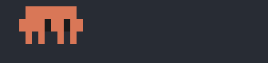 | **Pacing** | Back and forth, slowly |
| 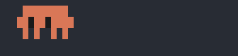 | **Looking around** | |
| 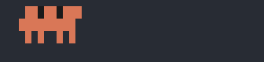 | **Head scratch** | |
|  | **Foot tap** | |
| 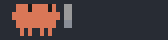 | **Lightbulb** | Flickers, then lights up |
| 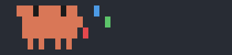 | **Juggling** | |
| 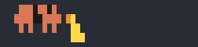 | **Rubber duck** | Talks the problem through; the duck quacks back |
|  | **Peekaboo** | |
|  | **Hiccups** | |
| 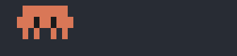 | **Sneeze** | Ah... ah... choo! |

### While a tool runs

| | Act | When |
|---|---|---|
|  | **Typing** | Editing files. On long edits a cat takes over the keyboard |
|  | **Pencil** | Editing files |
|  | **Scanning** | Reading files |
| 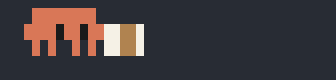 | **Book** | Reading files |
| 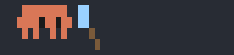 | **Magnifying glass** | Searching code |
| 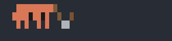 | **Digging** | Searching code |
| 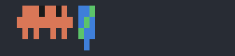 | **Globe** | Web search and fetch, `curl`, `wget` |
|  | **Clipboard** | To-do lists and test runs |
| 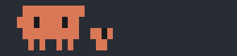 | **Buddy** | Subagents: a mini Clawd runs off on an errand |
|  | **Walking** | Other tools. Watch out for the banana peel |
| 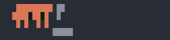 | **Hammering** | Other tools, and builds: `make`, `tsc`, `build` |
| 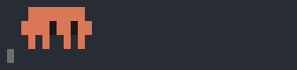 | **Running** | Any other command |
| 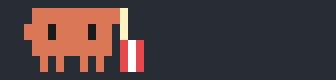 | **Popcorn** | A command still running after 8 seconds |

### Command puns

| | Act | Command |
|---|---|---|
| 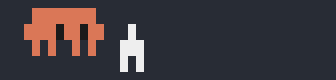 | **Rocket** | `git push` |
| 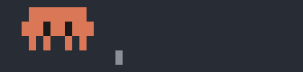 | **Boom** | `git push --force` |
| 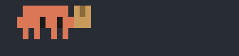 | **Box** | `git commit`, `npm install` and friends |
| 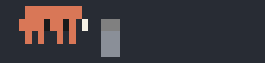 | **Trash can** | `rm` |
| 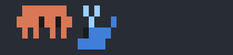 | **Whale** | `docker`, `kubectl` |
|  | **Dozing** | `sleep` |
| 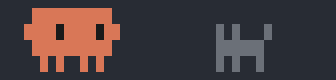 | **Cat** | `cat` |
|  | **Log** | `git log` |
| 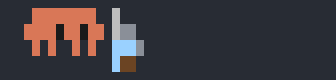 | **Brewing** | `brew` |
| 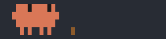 | **Branch** | `git branch`, `git checkout -b`, `git switch -c` |
|  | **Ping-pong** | `ping` |
| 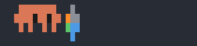 | **Spinning top** | `top`, `htop` |
| 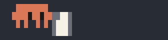 | **The manual** | `man` |
| 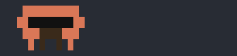 | **Disguise** | `sudo` |
|  | **Blame** | `git blame` |
| 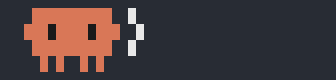 | **Echo** | `echo` |
| 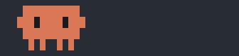 | **Nodding** | `yes` |
| 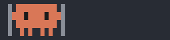 | **Squished** | `tar`, `zip`, `gzip` |
| 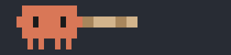 | **Tug of war** | `git pull` |
| 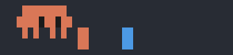 | **Merge** | `git merge` |

### When something fails

One at random. The second failure in a row always flips the table.

| | Act | |
|---|---|---|
|  | **Red flash** | |
|  | **Sweat drop** | |
|  | **Facepalm** | |
| 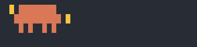 | **Dizzy** | |
| 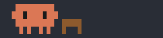 | **Table flip** | |
|  | **Rain cloud** | |
|  | **Faceplant** | |

### When a turn is done

One at random.

| | Act | |
|---|---|---|
|  | **Hop** | |
| 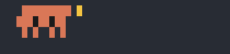 | **Wave** | |
| 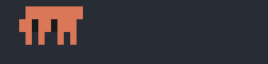 | **Spin** | |
|  | **Dance** | |
| 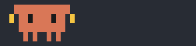 | **Flex** | |
|  | **Heart** | |
| 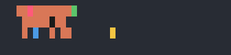 | **Confetti** | |
|  | **Bow** | |
| 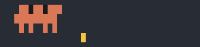 | **Fireworks** | |
| 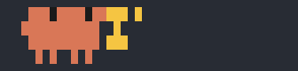 | **Trophy** | |
|  | **Deal with it** | |
|  | **Disco** | |
|  | **Moonwalk** | |

### On long turns

After a minute he puts his headphones on, and from 30 seconds in he takes the odd break while thinking.

| | Act | |
|---|---|---|
| 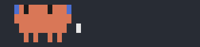 | **Headphones** | Turns longer than a minute |
| 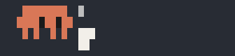 | **Coffee** | |
|  | **Yawn** | |
|  | **Stretch** | |
|  | **Nap** | |
|  | **Cookie** | |
| 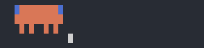 | **Music** | |
| 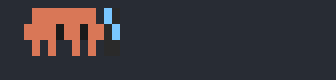 | **Phone** | |
| 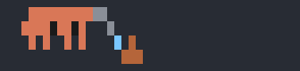 | **Watering** | |
|  | **Ball** | |
|  | **Fishing** | Sometimes he lands a boot |

## Develop

```
claude plugin validate plugins/clawd
claude plugin test plugins/clawd
claude --plugin-dir plugins/clawd
```

The GIFs come from `scripts/render-clawd-gifs.ts`. After changing an act, run `bun scripts/render-clawd-gifs.ts` (needs [Bun](https://bun.sh) and ImageMagick) to render them again.
